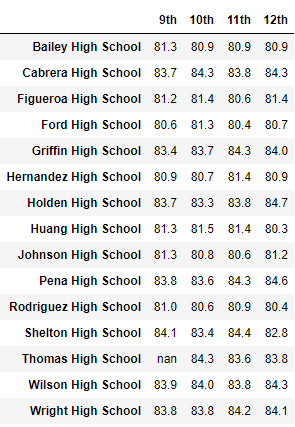
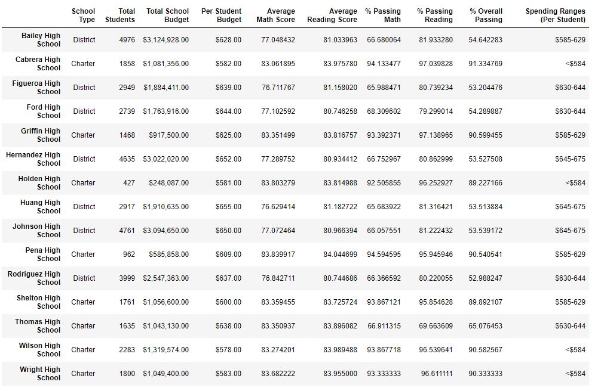

# School_District_Analysis_Challenge

## Overview of the school district analysis:
The following analysis is developed by the office of the chief data scientist for the city school district as part of her responsibilities to provide analysis and reporting for standardized testing; to create and convey incites and patterns on standardized testing performance, trends and patterns.

### Purpose
The purpose is to inform discussion and decisions at the school and district level.

### Scope
The initial scope of this analysis was to focus on student funding and standardized test scores providing the following information:
1.	A high-level snapshot of the district's key metrics, presented in a table format

2.	An overview of the key metrics for each school, presented in a table format

3.	Tables presenting each of the following metrics:
* Top 5 and bottom 5 performing schools, based on the overall passing rate
* The average math score received by students in each grade level at each school
* The average reading score received by students in each grade level at each school
* School performance based on the budget per student
* School performance based on the school size 
* School performance based on the type of school

### Adjusted Scope
The above information is part of this report but, the scope was adjusted to compare this analysis with the same analysis based on a change to the data for Thomas High School 9th grade Math and reading scores.
The School Board has indicated that the data files used for this analysis shows evidence of academic dishonesty. Specifically, the reading and math scores for the 9th grade at Thomas High School. In order to uphold state-testing standards the above analysis was repeated with the 9th grade Thomas High School reading and math scores removed. This report will show and contrast the differences with and without those scores.

## Family Education Rights and Privacy Act (FERPA)
The data for this analysis was done in compliance with the Family Education Rights and Privacy Act (FERPA)

## Detailed Results

### Conducting The analysis
The analysis was conducted using the Python interpreted coding language within Jupyter Notebooks.
The use of the pandas open source library was used extensively to take advantage of pre-built functions to clean organize, filter and group the below results. The code is available in the PyCitySchools_Challenge.ipynb file here. [PycitySchools_Challenge.ipynb](https://github.com/davidmcbee/School_District_Analysis_Challenge/blob/master/PyCitySchools_Challenge.ipynb)

#### Analysis Steps
* The two data files used are the schools_complete.csv and students_complete.csv files located here. [schools_complete.csv](./Resources/schools_complete.csv) and [students_complete.csv](./Resources/students_complete.csv)

* The files were brought into Jupyter Notebooks and placed in separate Data Frames.

* The names were cleaned to remove any prefixes and suffixes that contained words like Mrs., MD, DDS. This is just an example. Prefixes and suffixes like Jr or 3rd were left intact.

* The scores for the Thomas High School 9th grade math and reading scores were removed and replaced by “NaN, which is Python notation for a null (no value). It stands for “Not Allowed, No Zeros.”
* The data frames were merged, grouped and filtered and formatted to provide the different statistics

### Analysis Results

#### Note on convention
The term pre, as in pre - modification, refers to the data set that includes the Thomas High School 9th grade reading and math scores. Post, as in post-modification, refers to results where those scores were removed.

### Questions Answered
Per the scope of this analysis the below results are posed n question and answer format.

* How is the district summary affected?

Table 1 provides the pre-modification district Summary. 
 
 
 
 Table 1. Pre-District Summary

Table 2 is the same district summary but post modification.

Table 2. Post-District Summary
 
The percent passing math and passing reading dropped by 1 percent. These changes also result in a 1 percent drop in the overall passing percentage. The change in the average math score, .1 %, is very small and the average reading score remains unchanged.

* How is the school summary affected?

Looking at the school level, tables 3 and 4,

table 3. Pre-school Summary

Figure 4. Post School Summary

both tables are identical except for Thomas High School. Viewing the pre and post statistics for Thomas High School two items become evident. The first is that the average reading scores and average math scores do not vary by much; 83.85 versus 83.9 average reading scores, pre compared to post. For math, the difference is 83.42 versus 83.27 average math scores. In fact, the math score rose slightly after excluding the 9th grade scores. The second and more significant finding is that the percent passing reading and math differences are 97.31 versus 69.66 for reading, pre versus post and 93.27 versus 66.91 percent for math, pre versus post. These differences are significant and not having the 9th grade scores included are also reflected in the overall passing percentage; 90.95 versus 65.08 percent, pre versus post.

* How does replacing the ninth grade math and reading scores affect Thomas High School’s performance relative to the other schools?

From tables 5 and 6, the bottom 5 schools, in ascending order, are shown. Note that there is no change.

Figure 5. Pre-Bottom Five Schools
 

Figure 6. Post-Bottom 5 schools

If we look a little deeper, in tables 7 and 8, we can see that Thomas High School did drop from 14th from the lowest, (2nd from the highest), to 8th from the lowest, 6 positions.

Figure 7. Pre-Bottom Schools

 
Figure 8. Post Bottom All

* How does replacing the ninth-grade scores affect the following:

** Math and reading scores by grade

Except for the removal of the 9th grade reading and math scores from Thomas High School, nothing else changed. This can be seen in tables 9 and 10 for math and tables 11 and 12 for reading. This makes sense because the Thomas High School 9th grade math and reading scores are independent of other schools and because the 9th graders did take those tests it is unknown if there is a correlation between 9th grade scores and 11th – 12th grade scores.  

Figure 9. Pre-Average Math Scores by Grade

Figure 10. Post Average Math Scores by Grade

Figure 11. Pre-Average Reading Scores by Grade

Figure 12. Post Average Reading Scores by Grade

** Scores by school spending

Scores by school spending remain unchanged. See tables 13 and14. What is interesting in these two tables is that the percent Overall Passing category does not seem correlated to the Spending Ranges (Per Student) category for the schools. The overall passing percent does not go up with an increase in spending per student.

Figure 13. Pre-School Spending by School

Figure 14. Post- School Spending by School

** Scores by school size

Tables 15 and 16 bring out two points.
One. In general, there is an inverse relationship between school size and passing percentages. Percent passing math, percent passing reading and overall passing percentages decrease with an increase in school size.  
Two. The difference when removing the Thomas High School 9th grade scores is plain to see; a 6 percent drop.

Figure 15. Pre-Scores by School Size

Figure 16. Post-School Scores by School Size

** Scores by school type

Tables 17 and 18 also bring out two points.
One. Charter schools have higher math and reading averages as well as passing percentages.
Two. Thomas High School is a charter school. The drop due to removing 9th grade scores is evident.

Figure 17. Pre-Scores by School Type

Figure 18. Post-Scores by School Type

## Results Summary
In summary, the differences after removing the Thomas High School 9th grade scores are:
1. Thomas High school dropped 6 positions in the schools passing percentages.

2. Except for the removal of the 9th grade reading and math scores from Thomas High School, all average math and reading scores by grade, for all schools remained the same. This includes the other grades at Thomas High School.

3. School spending did not have any effect on the difference in scores and, in fact, does not appear to be correlated to passing percentages. Further, given that spending per student at Thomas High School is not in the top spending category, nor in the bottom spending category, this does not appear to contribute to the reason for evidence of academic dishonesty.

4. The difference in school size shows an inverse relationship between school size and passing percentages and results in a 6 point percentage drop due to those 9th grade score removals.

5. Looking at school types, charter schools scored  higher and the difference in removing the 9th grade scores shows in the drop those percentages for pre and post charter schools. 
